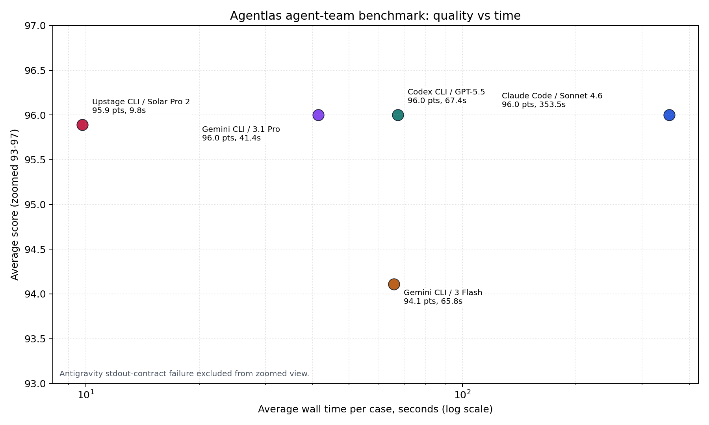
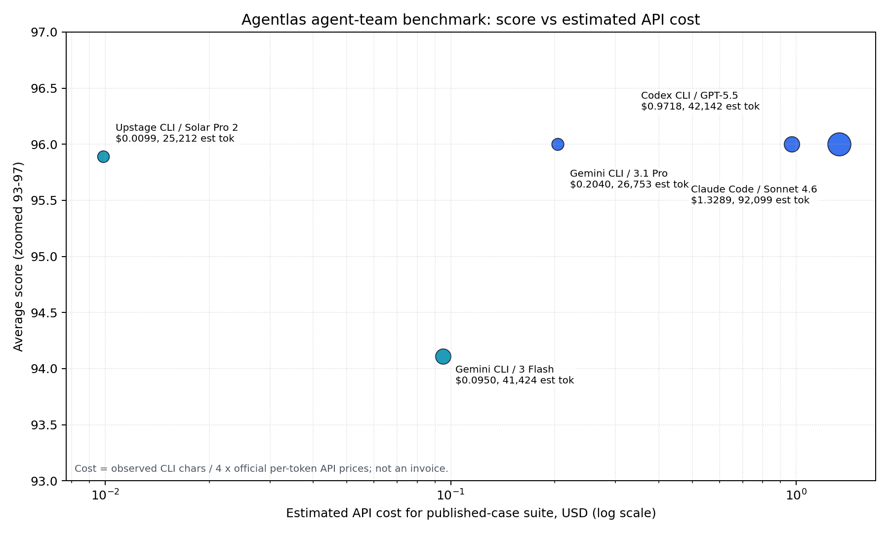
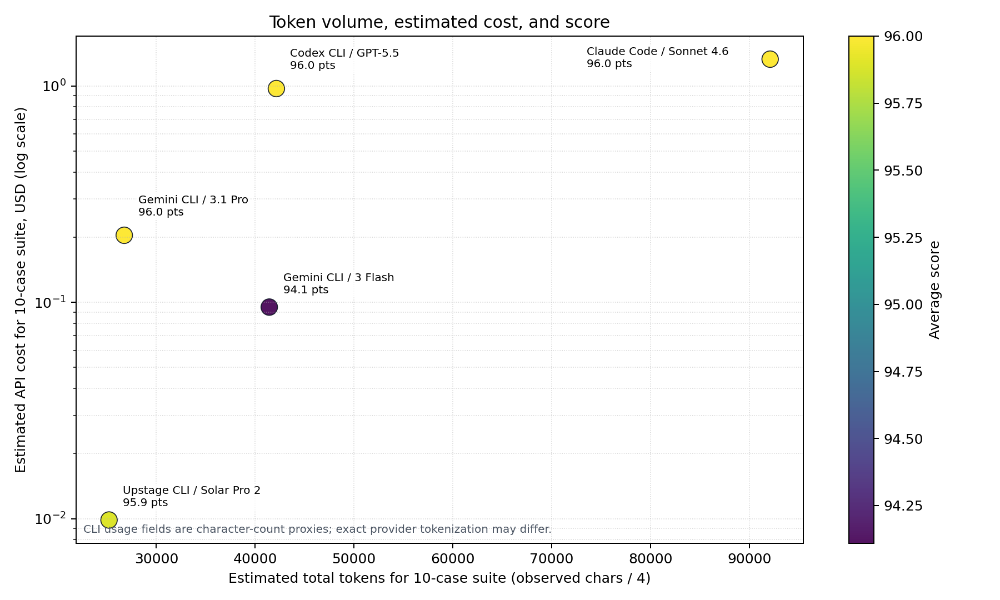

<p align="center">
  
</p>

<h1 align="center">Agentlas Model Benchmark</h1>

<p align="center">
  <a href="https://agentlas.cloud">agentlas.cloud</a>
  ·
  <a href="https://github.com/jeongmk522-netizen/Agentlas_public_repo">Lab Hub</a>
</p>

## Abstract

This repository reports a long-timeout operational benchmark of model runtimes building installable Agentlas agent-team packages. The current public dataset uses nine scored public workflow cases: investment research, AML/fraud investigation, disaster-response drones, film production, marketing, enterprise software delivery, hospital operations, supply-chain control, and SOC response.

The important correction is methodological: earlier short-timeout runs made Claude and GPT look weak, but the long-timeout run shows that was a harness artifact. With enough time, Claude Sonnet 4.6, GPT-5.5, and Gemini 3.1 Pro tie at 96.0 average quality. Solar Pro 2 is effectively tied on quality at 95.9, while being the fastest and lowest-cost runtime in this public suite by the proxy estimate.

## Research Question

Can a model runtime produce an operational Agentlas agent-team package for complex workflows, rather than a role list or conceptual plan?

The benchmark evaluates:

- agent-team structure and ownership
- dynamic tool and credential setup
- memory/context handling and evidence freshness
- workflow states, handoffs, and approval gates
- installability, smoke tests, and operational controls
- score/cost/time tradeoffs

## Headline Result

| Runtime | Model | Public cases | LLM success | Avg score | Avg time | Est. tokens | Est. suite cost* | Reading |
|---|---|---:|---:|---:|---:|---:|---:|---|
| Claude Code | `claude-sonnet-4-6` | 9 | 9 | 96.0 | 353.50s | 92,099 | $1.3289 | Top quality, slowest. |
| Codex CLI | `gpt-5.5` | 9 | 9 | 96.0 | 67.40s | 42,142 | $0.9718 | Top quality, higher proxy cost. |
| Gemini CLI | `gemini-3.1-pro-preview` | 9 | 9 | 96.0 | 41.41s | 26,753 | $0.2040 | Top quality with better speed/cost. |
| Upstage CLI | `solar-pro2` | 9 | 9 | 95.9 | 9.79s | 25,212 | $0.0099 | Near-top quality; best speed/cost. |
| Gemini CLI | `gemini-3-flash-preview` | 9 | 9 | 94.1 | 65.78s | 41,424 | $0.0950 | Stable, slightly lower quality. |
| Antigravity CLI | `default` | 9 | 0 | 0.0 | 1.43s | 0 | n/a | stdout contract failure, not model-quality evidence. |

*Cost is not an invoice. CLI usage is recorded as observed character-count units; this report estimates tokens as `chars / 4` and applies public API list prices for relative comparison.

## Figures

### Quality vs Time



This scatter shows the main operational finding: Solar Pro 2 is much faster while remaining within 0.1 points of the 96.0 quality leaders. Claude reaches the same top score, but with much higher wall-clock latency in this run.

### Quality vs Estimated Cost



The score/cost chart separates model capability from economic efficiency. GPT-5.5 and Claude tie the top score, but their proxy suite costs are much higher. Solar Pro 2 is the outlier on cost efficiency.

### Tokens, Cost, and Score



The token/cost view shows why raw quality alone is not enough for an agent-team runtime choice. Gemini 3.1 Pro uses fewer estimated tokens than GPT-5.5 and Claude while matching their score. Solar Pro 2 has the lowest estimated token and cost footprint among successful high-quality runs.

## Main Findings

1. Timeout mattered more than expected. The earlier weak Claude/GPT result was not a reliable model-quality finding; it was a short-timeout artifact.
2. Quality leaders are clustered. Claude Sonnet 4.6, GPT-5.5, and Gemini 3.1 Pro tie at 96.0; Solar Pro 2 is effectively tied at 95.9.
3. Operational efficiency is not clustered. Solar Pro 2 is the fastest and cheapest by the proxy estimate. Gemini 3.1 Pro is the best non-Solar balance among the 96.0 models.
4. Gemini Flash is viable but lower-scoring. It completed all public cases, but averaged 94.1 rather than 96.0.
5. Antigravity is a runtime-contract failure in this setup. It did not return consumable stdout, so it should not be interpreted as evidence about the underlying model.

## Dataset

Primary public artifacts:

- [data/evaluations/agentlas_meta_long_timeout_summary.csv](data/evaluations/agentlas_meta_long_timeout_summary.csv): runtime-level summary.
- [data/evaluations/agentlas_meta_long_timeout_scores.csv](data/evaluations/agentlas_meta_long_timeout_scores.csv): prompt-level scores.
- [data/evaluations/agentlas_meta_token_cost_score.csv](data/evaluations/agentlas_meta_token_cost_score.csv): token/cost/score table.
- [data/evaluations/agentlas_meta_reviewed_summary.json](data/evaluations/agentlas_meta_reviewed_summary.json): reviewed aggregate metadata.
- [docs/paper.md](docs/paper.md): paper-style writeup.
- [docs/methodology.md](docs/methodology.md): scoring and metadata method.
- [docs/marketplace-use-cases.md](docs/marketplace-use-cases.md): public-safe marketplace use cases derived from the benchmark.

## Method Summary

All included runtimes were evaluated on the same public workflow prompt set under a 900,000 ms per-case timeout. Outputs were scored on a 100-point public rubric covering request fit, team structure, dynamic tools, memory/context handling, workflow handoffs, installability, governance/safety, and observability/cost.

One non-public case is excluded from the scored public aggregate. The public marketplace pack contains a safe replacement workflow for that slot.

The score should be read as an operational Agentlas package score, not a general chat benchmark. It measures whether a runtime can produce a structured, installable, workflow-aware agent-team package under this harness.

## Reproducible Public Outputs

```bash
python3 scripts/compile_long_timeout_report.py
python3 scripts/export_team_use_cases.py
bash scripts/public_safety_check.sh
```

These commands regenerate the public CSV/JSON summaries, charts, marketplace use-case files, and safety scan from the reviewed operator source. Provider keys, raw private transcripts, and non-public execution details are not stored in this repository.

## Public Safety Boundary

This repository intentionally publishes reviewed aggregate data and curated public workflow specs only. It does not publish provider keys, private logs, raw generated repos, or non-public capability cases. The safety check blocks common secret formats, private local paths, and non-public capability labels before publishing.
